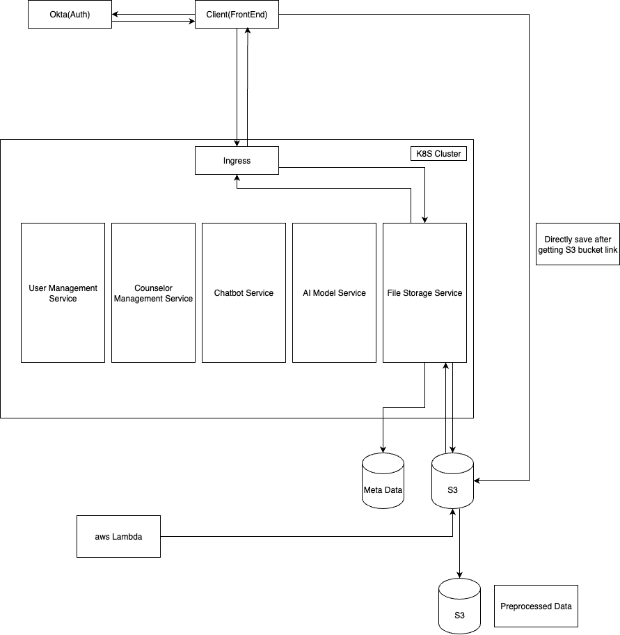

# Enhancing Multimodal Fusion Techniques for Depression Detection

## Overview
This project focuses on advancing multimodal fusion techniques for depression detection by addressing key challenges and integrating clinical data into the system. Our main contributions include:
- **Handling Missing Modalities:** Developing methods to manage incomplete data when some modalities are absent, ensuring robust performance.
- **Addressing Class Imbalance:** Removing or balancing classes in datasets to prevent overfitting and improve generalization.
- **Incorporating Clinical Data:** Extracting clinically relevant information from transcripts to enhance the accuracy of depression detection.
- **Counselor Channeling Web Application:** Building a web platform that allows users to connect with counselors and monitor depression status.
- **Chatbot Integration:** Providing an interactive chatbot that asks questions, gathers user responses, and predicts depression levels based on answers.

## System Workflow
1. **Data Processing & Model Training**
   - Preprocessing multimodal data (audio, video, text, clinical).
   - Handling missing modalities and class imbalance.
   - Incorporating clinical data extracted from transcripts.
   - Training deep learning models using Python, PyTorch, etc.
2. **Web Application**
   - Frontend developed with React.
   - Backend built with Spring Boot.
   - Users can connect with counselors, view depression assessments, and interact with the chatbot.
3. **Deployment & Infrastructure**
   - Containerization using Docker and Kubernetes.
   - Cloud deployment on AWS:
     - S3 for storing videos and preprocessed data.
     - Lambda functions for triggering preprocessing tasks.

## Web Application High-Level Architecture

### System Architecture Overview
The web application follows a microservices architecture pattern with clear separation of concerns between frontend, backend, and AI processing components.

  

### Component Architecture

#### Frontend Layer (React.js)
- **User Dashboard**: Personal depression assessment history and trends
- **Counselor Portal**: Interface for mental health professionals
- **Chatbot Interface**: Interactive depression screening questionnaire
- **Real-time Communication**: WebSocket integration for counselor-patient communication
- **File Upload Components**: Secure upload for audio/video data
- **Authentication Module**: User login, registration, and session management

#### Backend Layer (Spring Boot)
- **Ingress Controller**: RESTful endpoints for frontend communication
- **Authentication Service**: JWT-based user authentication and authorization
- **User Management Service**: User profiles, roles, and permissions
- **Counselor Matching Service**: Algorithm-based counselor assignment
- **Session Management**: Counseling session scheduling and tracking
- **Data Processing Coordinator**: Orchestrates AI model inference requests
- **Notification Service**: Email/SMS notifications for appointments and results

#### AI Processing Layer (Python)
- **Model Inference API**: Serves trained depression detection models
- **Multimodal Fusion Service**: Combines audio, video, and text predictions
- **Feature Extraction Services**: Processes raw data into model-ready features

#### Cloud Infrastructure (AWS)
- **S3 Storage**: Raw and processed multimedia files
- **Lambda Functions**: Serverless data preprocessing triggers

## Data Preprocessing Methods

| Data Type | Preprocessing Method | Description |
|-----------|---------------------|-------------|
| **Audio Data Preprocessing** | | |
| **Video Data Preprocessing** | | |
| **Text Data Preprocessing** | | |
| **Clinical Data Preprocessing** | | |
| **Multimodal Data Integration** | | |

## Tech Stack
| Component | Technologies |
| --------- | ------------ |
| Modal Training & Preprocessing | Python, PyTorch, NumPy, Pandas, ... |
| Frontend Development | React.js |
| Backend Development | Spring Boot (Java), Flask |
| Containerization & Deployment | Docker, Kubernetes, AWS S3, AWS Lambda |

## Features
- Multimodal data fusion handling missing modalities.
- Dataset balancing to prevent overfitting.
- Clinical data extraction from transcripts for improved accuracy.
- Counselor channeling through a user-friendly web interface.
- Interactive chatbot for depression screening based on user responses.
- Cloud-based scalable deployment.

## Installation & Usage
---

## Research Team
### Team Members
- E/19/087, Dissanayaka M.A.S.R, [email](mailto:e19087@eng.pdn.ac.lk)
- E/19/260, Neranji W.K.G.A.G, [email](mailto:e19260@eng.pdn.ac.lk)
- E/19/264, Nishantha R.P.T, [email](mailto:e19264@eng.pdn.ac.lk)

### Supervisors
- Prof Roshan Ragel, [email](mailto:roshanr@eng.pdn.ac.lk)
- Dhanushki Pavithya, [email](mailto:e14240@ce.pdn.ac.lk)

---

## Links
- [Project Repository](https://github.com/cepdnaclk/e19-4yp-Enhancing-Multimodal-Fusion-Techniques-for-Depression-Detection)
- [Project Page](https://cepdnaclk.github.io/e19-4yp-Enhancing-Multimodal-Fusion-Techniques-for-Depression-Detection/)
- [Department of Computer Engineering](http://www.ce.pdn.ac.lk/)
- [University of Peradeniya](https://eng.pdn.ac.lk/)

---
