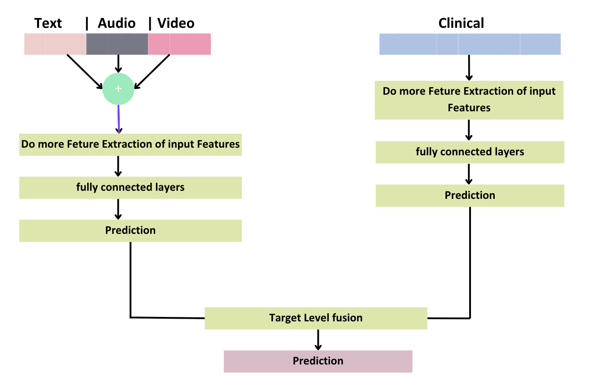
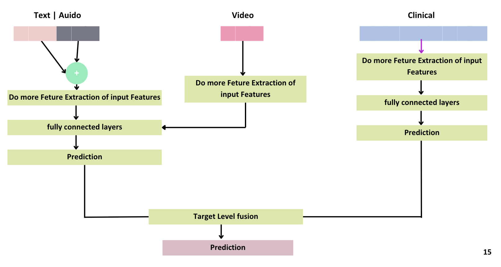

# Enhancing Multimodal Fusion Techniques for Depression Detection

## Dual Objectives

### Primary Research Goal
Develop an advanced **multimodal deep learning framework** for accurate depression detection utilizing CNN architectures and sophisticated fusion techniques across multiple data modalities.

### Clinical Application
Build a comprehensive **counselor channeling web platform** integrated with intelligent chatbot-based depression screening to bridge the gap between detection and treatment.

## Research Team

### Team Members

- E/19/087, Dissanayaka M.A.S.R, [email](mailto:e19087@eng.pdn.ac.lk)
- E/19/260, Neranji W.K.G.A.G, [email](mailto:e19260@eng.pdn.ac.lk)
- E/19/264, Nishantha R.P.T, [email](mailto:e19264@eng.pdn.ac.lk)

### Supervisors

- Prof Roshan Ragel, [email](mailto:roshanr@eng.pdn.ac.lk)
- Dhanushki Pavithya, [email](mailto:e14240@ce.pdn.ac.lk)

## Table of Contents

1. [Executive Summary](#executive-summary)
2. [Literature Review](#literature-review)
3. [Research Methodology](#research-methodology)
4. [System Architecture](#system-architecture)
5. [Implementation Details](#implementation-details)
6. [Experimental Results](#experimental-results)
7. [Clinical Impact](#clinical-impact)
8. [Future Work](#future-work)
9. [Publications](#publications)
10. [Links](#links)

## Executive Summary

### Problem Statement
Current depression detection systems suffer from limited accuracy, poor generalization across diverse populations, and insufficient integration of multimodal data sources. Existing approaches fail to meet clinical requirements for reliable mental health assessment.

### Innovation Approach
This research introduces a novel **hybrid multimodal fusion framework** that intelligently combines textual, audio, visual, and clinical data streams through advanced deep learning architectures. Our approach addresses key limitations through:

- **Enhanced Feature Integration**: Target-level weighted fusion with learned modality importance
- **Clinical Validation**: Integration with established medical datasets and screening protocols
- **Real-world Application**: User-friendly web platform for practical deployment

### Expected Impact
- Improved diagnostic accuracy for depression detection
- Reduced healthcare burden through automated screening
- Enhanced accessibility to mental health resources
- Foundation for personalized treatment planning

## Literature Review

### Current State of Research

**Multimodal Detection Approaches**
- CNN-based architectures for cross-modal feature extraction
- Integration of textual, audio, and video modalities
- Counselor channeling applications for professional referral systems

### Modality-Specific Techniques

| **Modality** | **Current Methods** | **Limitations** |
|--------------|---------------------|-----------------|
| **Text** | LSTM, BERT, GPT-based models | Limited emotional context understanding |
| **Audio** | CNN, LSTM, Wav2Vec approaches | Poor generalization across demographics |
| **Video** | CNN, ResNet-50 architectures | Insufficient temporal feature capture |
| **Clinical** | MIMIC-III dataset utilization | Bias handling and data scarcity issues |

### Identified Research Gaps
- **Fusion Limitations**: Predominant reliance on early/late fusion with limited dataset diversity
- **Generalization Issues**: Poor performance across different populations and clinical settings
- **Integration Challenges**: Lack of comprehensive multimodal frameworks
- **Clinical Applicability**: Insufficient validation for real-world deployment

## Research Methodology

### Comprehensive Multimodal Framework

Our methodology employs a sophisticated deep learning architecture combining CNNs with advanced target-level fusion techniques:

### Data Acquisition and Preprocessing

**Primary Datasets:**
- **DAIC-WOZ**: Distress Analysis Interview Corpus for multimodal analysis
- **MIMIC-III**: Medical Information Mart for clinical data integration

**Data Modalities:**
- **Textual Data**: Interview transcripts, medical notes, survey responses
- **Audio Signals**: Speech patterns, vocal characteristics, prosodic features
- **Visual Information**: Facial expressions, micro-expressions, behavioral cues
- **Clinical Records**: Medical history, PHQ-9 scores, treatment documentation

### Feature Extraction Pipeline

| **Modality** | **Extraction Method** | **Key Features** |
|--------------|----------------------|------------------|
| **Text** | LIWC + HuggingFace Transformers | Sentiment analysis, linguistic patterns, semantic embeddings |
| **Audio** | EDIAOZ Framework | Pitch variation, MFCC coefficients, jitter, shimmer, prosodic features |
| **Video** | OpenFace Toolkit | Facial Action Units (FAUs), eye gaze patterns, head pose dynamics |
| **Clinical** | BioBERT Embeddings | Medical terminology understanding, clinical note analysis |

### Advanced Fusion Strategies

**Multi-Level Fusion Approach:**
- **Early Fusion**: Feature-level concatenation for joint representation learning
- **Late Fusion**: Decision-level combination of modality-specific predictions  
- **Hybrid Fusion**: Adaptive weighted combination based on modality reliability
- **Target-Level Fusion**: Learned importance weighting for optimal feature integration

### Model Architecture Design

**Core Components:**
- **Modality-Specific Encoders**: CNN-based feature extraction networks
- **Attention Mechanism**: Cross-modal dependency learning
- **Fusion Network**: Adaptive weight learning for modality integration
- **Output Layer**: Depression severity scoring and binary classification

## System Architecture

### Early Fusion Architecture



**Design Philosophy:**
The Early Fusion model creates unified multimodal representations by combining features from all input modalities at the initial processing stage. This architecture enables the model to learn complex inter-modal relationships from the ground up, potentially capturing subtle correlations between different data streams that might be missed in later fusion approaches.

**Key Advantages:**
- Joint feature learning across modalities
- Comprehensive inter-modal relationship capture
- Unified representation space for decision making

### Late Fusion Architecture



**Design Philosophy:**
The Late Fusion model processes each modality through specialized, independent neural networks before combining their outputs at the decision level. This approach allows for modality-specific optimization and specialized feature extraction, with each pathway contributing its expertise to the final diagnostic decision.

**Key Advantages:**
- Specialized processing per modality
- Independent optimization of modality-specific features
- Flexible integration of diverse prediction confidences

### Hybrid Fusion Framework

**Advanced Integration Strategy:**
Our novel hybrid approach combines the strengths of both early and late fusion through an adaptive weighting mechanism that learns optimal combination strategies based on input characteristics and modality reliability.

## Implementation Details

### Technology Stack

**Core ML Framework**
- **Primary Language**: Python 3.10+
- **Deep Learning**: PyTorch with CUDA acceleration tensorflow
- **NLP Processing**: HuggingFace Transformers, NLTK
- **Model Training**: Scikit-learn, PyTorch Lightning
- **Feature Extraction**: OpenFace, EDIAOZ, BioBERT

**Web Application Stack**
- **Frontend**: React.js with Material-UI components
- **Backend**: Node.js with Express.js framework
- **Database**: MongoDB for user data and session management
- **API Integration**: RESTful services for model inference
- **Deployment**: Docker containerization with Kubernetes orchestration

### Development Workflow
```bash
# Environment Setup
conda create -n lumithrive python=3.10
conda activate lumithrive
pip install -r requirements.txt

# Model Training Pipeline
python train_multimodal_model.py --config configs/hybrid_fusion.yaml

# Web Application Deployment
docker-compose up --build
```

### Model Training Pipeline

**Training Configuration:**


**Data Augmentation Strategies:**
- Audio: Noise injection, time stretching, pitch shifting
- Video: Frame sampling, temporal jittering, brightness variation
- Text: Synonym replacement, back-translation augmentation

## Experimental Results

### Performance Metrics

*Note: Results will be updated following completion of experimental phase*

**Evaluation Framework:**
- **Classification Metrics**: Accuracy, Precision, Recall, F1-Score
- **Regression Metrics**: Mean Absolute Error (MAE), Root Mean Square Error (RMSE)
- **Clinical Metrics**: Sensitivity, Specificity, Area Under ROC Curve (AUC-ROC)
- **Cross-Validation**: 5-fold stratified cross-validation for robust evaluation

**Expected Performance Targets:**
- **Overall Accuracy**: >85% across all modality combinations
- **Clinical Sensitivity**: >90% for depression detection
- **Specificity**: >80% to minimize false positives
- **Multimodal vs. Unimodal**: >15% improvement with fusion approaches

### Ablation Studies

**Planned Experiments:**
1. **Modality Importance Analysis**: Individual and combined modality performance
2. **Fusion Strategy Comparison**: Early vs. Late vs. Hybrid fusion effectiveness
3. **Architecture Sensitivity**: Impact of network depth and attention mechanisms
4. **Dataset Generalization**: Cross-dataset validation and transfer learning

## Clinical Impact

### Healthcare Integration

**Clinical Workflow Enhancement:**
- **Automated Screening**: Rapid initial assessment for large patient populations
- **Decision Support**: Evidence-based recommendations for mental health professionals
- **Progress Monitoring**: Longitudinal tracking of patient mental health status
- **Resource Allocation**: Efficient triage and referral system optimization

### Accessibility Improvements

**Democratizing Mental Health Care:**
- **Remote Assessment**: Telemedicine-compatible depression screening
- **Multilingual Support**: Adaptation for diverse linguistic populations
- **Cultural Sensitivity**: Training on diverse demographic datasets
- **Cost Reduction**: Decreased burden on mental health professionals

### Ethical Considerations

**Responsible AI Development:**
- **Privacy Protection**: HIPAA-compliant data handling and storage
- **Bias Mitigation**: Fairness testing across demographic groups
- **Transparency**: Explainable AI techniques for clinical decision support
- **Human Oversight**: Integration with professional clinical judgment

## Future Work

### Research Extensions


### Technical Innovations

**Advanced Modeling Approaches:**
- **Federated Learning**: Privacy-preserving distributed model training
- **Graph Neural Networks**: Modeling complex patient-symptom relationships
- **Transformer Architectures**: Enhanced attention mechanisms for multimodal fusion
- **Continual Learning**: Adaptive models that improve with new data

## Publications

*Publications will be added upon completion of experimental phases and peer review process*

<!-- Future publications will be listed here:
1. [Semester 7 Technical Report](./)
2. [Midterm Presentation Slides](./)
3. [Final Thesis Document](./)
4. [Defense Presentation](./)
5. Dissanayaka M.A.S.R, Neranji W.K.G.A.G, Nishantha R.P.T. "Enhancing Multimodal Fusion Techniques for Depression Detection" (2025). [PDF](./)
-->

## Links

- [Project Repository](https://github.com/cepdnaclk/e19-4yp-Enhancing-Multimodal-Fusion-Techniques-for-Depression-Detection)
- [Project Page](https://cepdnaclk.github.io/e19-4yp-Enhancing-Multimodal-Fusion-Techniques-for-Depression-Detection/)
- [Department of Computer Engineering](http://www.ce.pdn.ac.lk/)
- [University of Peradeniya](https://eng.pdn.ac.lk/)
